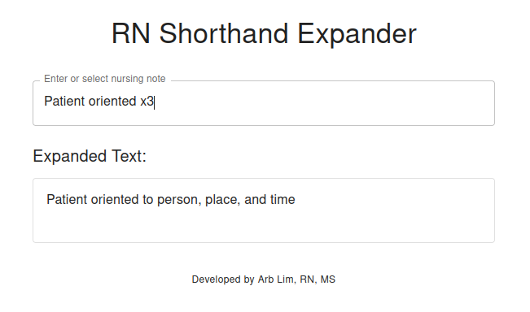

# RN Shorthand Expander

This application allows users to enter shorthand nursing notes (e.g., `Pt c/o SOB & CP`) and automatically expands them into full, readable phrases using a regex-driven abbreviation map.

## Skills Demonstrated

- **Regex processing**
- **Dynamic text rendering**
- **Local JSON lookup**

## Tech Stack

- **React** (with TypeScript)
- **Material UI**
- **Vite**

### Developed by **Arb Lim, RN, MS**

## License

This project is licensed under the [MIT License](https://opensource.org/licenses/MIT).
You are free to use, modify, and distribute this software with attribution.
